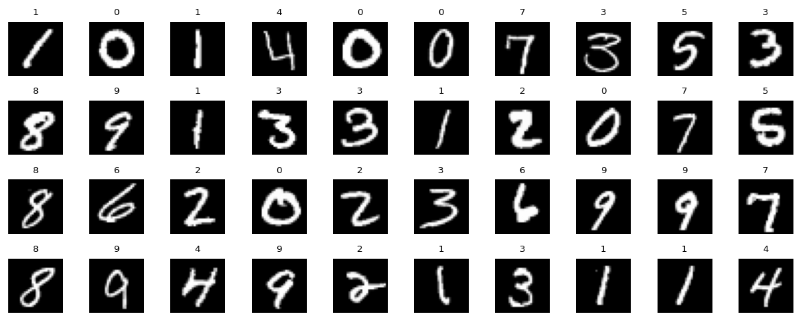
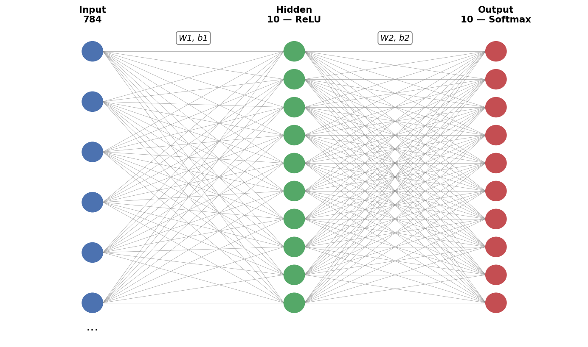

# neural-network-from-scratch

A two-layer neural network that classifies handwritten digits from the MNIST dataset — built **entirely from scratch**. No PyTorch, no TensorFlow, no Keras, no scikit-learn. Just NumPy for matrix math and calculus derived by hand: forward pass, backpropagation, and gradient descent, all written out explicitly.

Shout out to Samson Zhang, who inspired me to make this project.

Samson Zhang's video: https://youtu.be/w8yWXqWQYmU?si=lWDjafKlU13UBTb8

## Dataset

The [MNIST](MNIST.csv) dataset contains 42,000 grayscale images of handwritten digits (0–9), each 28×28 pixels, flattened into 784-pixel rows.

## Architecture

A feedforward network with one hidden layer:

- **Input layer:** 784 units (28×28 pixels)
- **Hidden layer:** 10 units, ReLU activation
- **Output layer:** 10 units, softmax activation (one per digit class)

## Training

- **Loss:** cross-entropy
- **Optimizer:** vanilla gradient descent
- **Weight init:** uniform `[-0.5, 0.5]` (`np.random.rand(...) - 0.5`)
- **Input normalization:** pixels scaled to `[0, 1]`
- **Split:** 80% train / 20% test

## Results

After 500 epochs with a learning rate of 0.1:

- **Train accuracy:** 83.9%
- **Test accuracy:** 84.7%

Test accuracy slightly exceeding train accuracy indicates the model was able to generalise well.

## Files

- [main.ipynb](main.ipynb) — full implementation and training loop
- [MNIST.csv](MNIST.csv) — dataset
